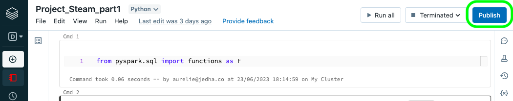

# Steam's videogames platform 👾

960 min

https://app.jedha.co/course/project-steam-ft/steam-ft

## Company's description 📇

**Steam** is a <ins>video game digital distribution</ins> service and storefront from <ins>Valve</ins>. It was launched as a software client in September 2003 to provide game updates automatically for Valve's games, and expanded to distributing third-party titles in late 2005. Steam offers various features, like <ins>digital rights management</ins> (DRM), <ins>game server matchmaking</ins> with <ins>Valve Anti-Cheat</ins> measures, <ins>social networking</ins>, and <ins>game streaming</ins> services. Steam client's functions include game update automation, cloud storage for <ins>game progress</ins>, and community features such as direct messaging, in-game overlay functions and a virtual <ins>collectable</ins> marketplace.

## Project 🚧

You're working for <ins>Ubisoft</ins>, a French video game publisher. They'd like to release a new revolutionary videogame! They asked you conduct a global analysis of the games available on Steam's marketplace in order to better understand the videogames ecosystem and today's trends.

## Goals 🎯

The ultimate goal of this project is to understand what factors affect the popularity or sales of a video game. But your boss asked you to take advantage of this opportunity to analyze the video game market globally.

To carry out this project, you will have to adopt different levels of analysis. Your boss gave you a list of examples of questions that would be interesting:

**Analysis at the "macro" level**

- Which publisher has released the most games on Steam?
    
- What are the best rated games?
    
- Are there years with more releases? Were there more or fewer game releases during the Covid, for example?
    
- How are the prizes distributed? Are there many games with a discount?
    
- What are the most represented languages?
    
- Are there many games prohibited for children under 16/18?
    

**Genres analysis**

- What are the most represented genres?
    
- Are there any genres that have a better positive/negative review ratio?
    
- Do some publishers have favorite genres?
    
- What are the most lucrative genres?
    

**Platform analysis**

- Are most games available on Windows/Mac/Linux instead?
    
- Do certain genres tend to be preferentially available on certain platforms?
    

You're free to follow these guidelines, or to choose a different angle of analysis, as long as your analysis reveals relevant and useful information. 🤓

## Scope of this project 🖼️

You'll have to use **Databricks** and **PySpark** to conduct this EDA. Particularly, you'll have to use <ins>Databrick's visualisation tool</ins> to create the visualizations.

The dataset is available in our S3 bucket at the following url: [s3://full-stack-bigdata-datasets/Big_Data/Project_Steam/steam_game_output.json](s3://full-stack-bigdata-datasets/Big_Data/Project_Steam/steam_game_output.json).

## Helpers 🦮

To help you achieve this project, here are a few tips that should help you:

- To adopt different levels of analysis, it might be useful to create different dataframes.
    
- As the dataset is semi-structured with a **nested schema**, Pyspark's methods such as `getField()` and `explode()` may help you.
    
- There are some text and date fields in this dataset: Pyspark offers utilitary functions to manipulate these types of data efficiently 💡
    
- You can use agregate functions and `groupBy` to conduct segmented analysis.
    

## Deliverable 📬

To complete this project, you should deliver:

- One or several notebooks including data manipulation with PySpark and data visualization with Databrick's dashboarding tool.
    
- To make sure the jury can view all the visualizations, please use the "publish" button on Databricks notebooks to create a public url where a copy of your notebook will be available.
    
- While using the "publish" button, Databricks may tell you that your notebook's size exceeds the maximal size allowed. If this happens, just split your notebook in several notebooks.
    
- Please copy-paste the link(s) to your published notebooks into your Github repo such that the jury can access it easily. 😌
    

&nbsp;

&nbsp;

# Conseil de Raphaël

Faire les questions et en rajouter 3-4 pour le projet.

Il est facile et on peut le présenter au choix avec Tinder à l'oral.

&nbsp;

Redshift est optimisé pour moins de requêtes sur plus de données.  
RDS c'est pour des échanges constants sur une base de données "petite"  
 

Dans Databrick dans le retour des notebooks, il y a un bouton + avec visualisation  pour faire des graphes (utiles en capture d'écran).  
 

Faire un powerpoint, avec j'ai utilisé ça car tat tac tac, j'ai obtenu avec une visualisation et du code sur les slides si besoin.

&nbsp;